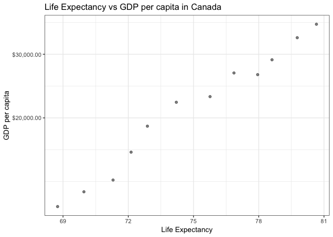
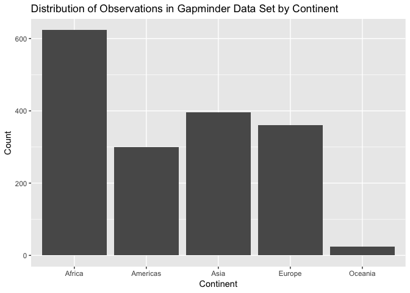
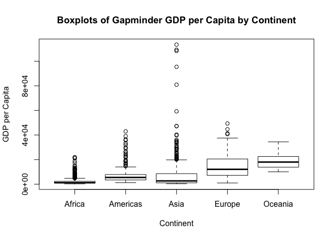
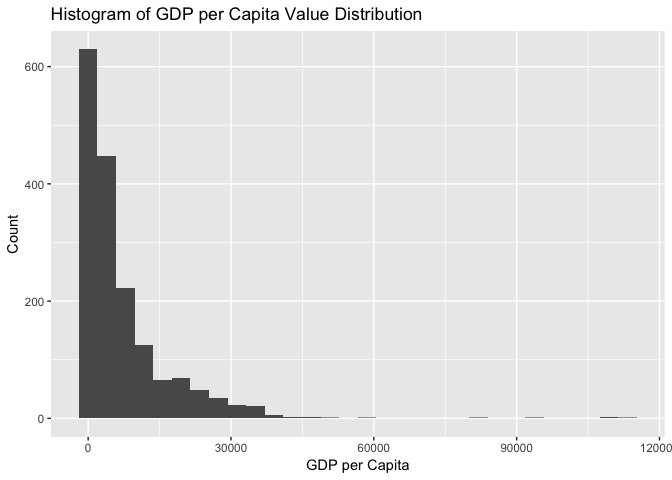
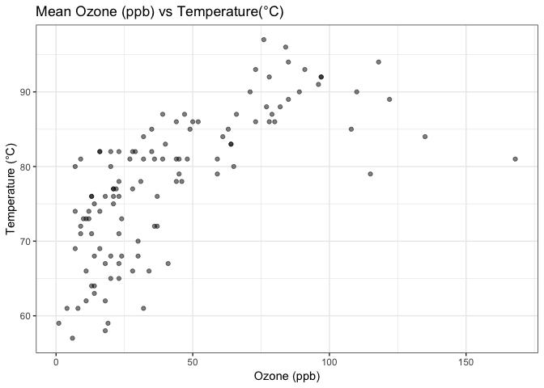
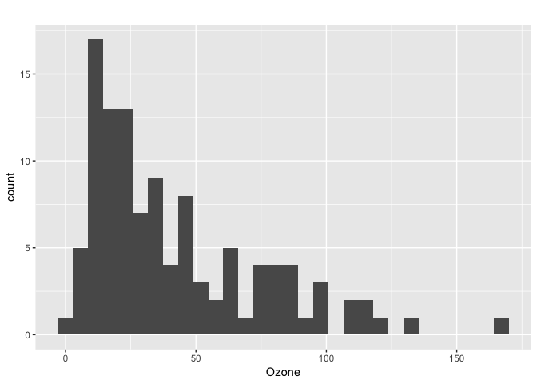

# Setting Up
Loading needed Packages

```r
library(gapminder)
library (tidyverse)
```


# Exercise 1: 1.1
Subsetting the gapminder dataset to three countries of choice
- Canada, United Kingdom and Germany - during the 1970s.
 

```r
filter(gapminder, 
       country == 'Canada'| country== 'United Kingdom' | country== 'Germany') %>%
  filter(year %in% (1970:1979)) %>%
  knitr::kable()
```


country          continent    year   lifeExp        pop   gdpPercap
---------------  ----------  -----  --------  ---------  ----------
Canada           Americas     1972     72.88   22284500    18970.57
Canada           Americas     1977     74.21   23796400    22090.88
Germany          Europe       1972     71.00   78717088    18016.18
Germany          Europe       1977     72.50   78160773    20512.92
United Kingdom   Europe       1972     72.01   56079000    15895.12
United Kingdom   Europe       1977     72.76   56179000    17428.75

# Exercise 1: 1.2

Selecting the GDP per Capita and Population from the subset of the
gapminder data created in Exercise 1: 1.1

```r
filter(gapminder, country == 'Canada'| country == 'United Kingdom'| country== 'Germany') %>% 
  filter(year %in% (1970:1979)) %>%
  select(country,gdpPercap) %>%
  knitr::kable()
```


country           gdpPercap
---------------  ----------
Canada             18970.57
Canada             22090.88
Germany            18016.18
Germany            20512.92
United Kingdom     15895.12
United Kingdom     17428.75

# Exercise 1: 1.3

Subset the gapminder dataset by countries that have experienced a drop in their
Life Expectancy

```r
gapminder %>%
  arrange(year) %>%
  group_by(country) %>%
   mutate (increaseLifeExp =  lifeExp-lag(lifeExp)) %>% 
   filter( (increaseLifeExp<0)) %>%
   DT::datatable() 
```

<!--html_preserve--><div id="htmlwidget-81d7a712e497758177ab" style="width:100%;height:auto;" class="datatables html-widget"></div>
<script type="application/json" data-for="htmlwidget-81d7a712e497758177ab">{"x":{"filter":"none","data":[["1","2","3","4","5","6","7","8","9","10","11","12","13","14","15","16","17","18","19","20","21","22","23","24","25","26","27","28","29","30","31","32","33","34","35","36","37","38","39","40","41","42","43","44","45","46","47","48","49","50","51","52","53","54","55","56","57","58","59","60","61","62","63","64","65","66","67","68","69","70","71","72","73","74","75","76","77","78","79","80","81","82","83","84","85","86","87","88","89","90","91","92","93","94","95","96","97","98","99","100","101","102"],["China","Cambodia","Czech Republic","Netherlands","Slovak Republic","Bulgaria","Cambodia","El Salvador","Poland","Uganda","Congo, Dem. Rep.","Croatia","Denmark","El Salvador","Eritrea","Hungary","Serbia","Uganda","Angola","Congo, Dem. Rep.","Norway","Poland","Romania","Rwanda","Zambia","Albania","Botswana","Bulgaria","Burundi","Cameroon","Central African Republic","Congo, Dem. Rep.","Congo, Rep.","Cote d'Ivoire","Hungary","Iraq","Jamaica","Kenya","Korea, Dem. Rep.","Liberia","Puerto Rico","Romania","Rwanda","Sierra Leone","Somalia","Tanzania","Uganda","Zambia","Zimbabwe","Botswana","Bulgaria","Cameroon","Central African Republic","Chad","Congo, Dem. Rep.","Congo, Rep.","Cote d'Ivoire","Gabon","Iraq","Kenya","Korea, Dem. Rep.","Lesotho","Malawi","Namibia","Nigeria","South Africa","Swaziland","Tanzania","Trinidad and Tobago","Uganda","Zambia","Zimbabwe","Benin","Botswana","Cameroon","Central African Republic","Chad","Cote d'Ivoire","Gabon","Ghana","Iraq","Jamaica","Kenya","Korea, Dem. Rep.","Lesotho","Malawi","Montenegro","Mozambique","Myanmar","Namibia","Nigeria","South Africa","Swaziland","Togo","Trinidad and Tobago","Zambia","Zimbabwe","Gabon","Lesotho","Mozambique","South Africa","Swaziland"],["Asia","Asia","Europe","Europe","Europe","Europe","Asia","Americas","Europe","Africa","Africa","Europe","Europe","Americas","Africa","Europe","Europe","Africa","Africa","Africa","Europe","Europe","Europe","Africa","Africa","Europe","Africa","Europe","Africa","Africa","Africa","Africa","Africa","Africa","Europe","Asia","Americas","Africa","Asia","Africa","Americas","Europe","Africa","Africa","Africa","Africa","Africa","Africa","Africa","Africa","Europe","Africa","Africa","Africa","Africa","Africa","Africa","Africa","Asia","Africa","Asia","Africa","Africa","Africa","Africa","Africa","Africa","Africa","Americas","Africa","Africa","Africa","Africa","Africa","Africa","Africa","Africa","Africa","Africa","Africa","Asia","Americas","Africa","Asia","Africa","Africa","Europe","Africa","Asia","Africa","Africa","Africa","Africa","Africa","Americas","Africa","Africa","Africa","Africa","Africa","Africa","Africa"],[1962,1972,1972,1972,1972,1977,1977,1977,1977,1977,1982,1982,1982,1982,1982,1982,1982,1982,1987,1987,1987,1987,1987,1987,1987,1992,1992,1992,1992,1992,1992,1992,1992,1992,1992,1992,1992,1992,1992,1992,1992,1992,1992,1992,1992,1992,1992,1992,1992,1997,1997,1997,1997,1997,1997,1997,1997,1997,1997,1997,1997,1997,1997,1997,1997,1997,1997,1997,1997,1997,1997,1997,2002,2002,2002,2002,2002,2002,2002,2002,2002,2002,2002,2002,2002,2002,2002,2002,2002,2002,2002,2002,2002,2002,2002,2002,2002,2007,2007,2007,2007,2007],[44.50136,40.317,70.29,73.75,70.35,70.81,31.22,56.696,70.67,50.35,47.784,70.46,74.63,56.604,43.89,69.39,70.162,49.849,39.906,47.412,75.89,70.98,69.53,44.02,50.821,71.581,62.745,71.19,44.736,54.314,49.396,45.548,56.433,52.044,69.17,59.461,71.766,59.285,69.978,40.802,73.911,69.36,23.599,38.333,39.658,50.44,48.825,46.1,60.377,52.556,70.32,52.199,46.066,51.573,42.587,52.962,47.991,60.461,58.811,54.407,67.727,55.558,47.495,58.909,47.464,60.236,54.289,48.466,69.465,44.578,40.238,46.809,54.406,46.634,49.856,43.308,50.525,46.832,56.761,58.453,57.046,72.047,50.992,66.662,44.593,45.009,73.981,44.026,59.908,51.479,46.608,53.365,43.869,57.561,68.976,39.193,39.989,56.735,42.592,42.082,49.339,39.613],[665770000,7450606,9862158,13329874,4593433,8797022,6978607,4282586,34621254,11457758,30646495,4413368,5117810,4474873,2637297,10705535,9032824,12939400,7874230,35481645,4186147,37740710,22686371,6349365,7272406,3326498,1342614,8658506,5809236,12467171,3265124,41672143,2409073,12772596,10348684,17861905,2378618,25020539,20711375,1912974,3585176,22797027,7290203,4260884,6099799,26605473,18252190,8381163,10704340,1536536,8066057,14195809,3696513,7562011,47798986,2800947,14625967,1126189,20775703,28263827,21585105,1982823,10419991,1774766,106207839,42835005,1054486,30686889,1138101,21210254,9417789,11404948,7026113,1630347,15929988,4048013,8835739,16252726,1299304,20550751,24001816,2664659,31386842,22215365,2046772,11824495,720230,18473780,45598081,1972153,119901274,44433622,1130269,4977378,1101832,10595811,11926563,1454867,2012649,19951656,43997828,1133066],[487.6740183,421.6240257,13108.4536,18794.74567,9674.167626,7612.240438,524.9721832,5138.922374,9508.141454,843.7331372,673.7478181,13221.82184,21688.04048,4098.344175,524.8758493,12545.99066,15181.0927,682.2662268,2430.208311,672.774812,31540.9748,9082.351172,9696.273295,847.991217,1213.315116,2497.437901,7954.111645,6302.623438,631.6998778,1793.163278,747.9055252,457.7191807,4016.239529,1648.073791,10535.62855,3745.640687,7404.923685,1341.921721,3726.063507,636.6229191,14641.58711,6598.409903,737.0685949,1068.696278,926.9602964,825.682454,644.1707969,1210.884633,693.4207856,8647.142313,5970.38876,1694.337469,740.5063317,1004.961353,312.188423,3484.164376,1786.265407,14722.84188,3076.239795,1360.485021,1690.756814,1186.147994,692.2758103,3899.52426,1624.941275,7479.188244,3876.76846,789.1862231,8792.573126,816.559081,1071.353818,792.4499603,1372.877931,11003.60508,1934.011449,738.6906068,1156.18186,1648.800823,12521.71392,1111.984578,4390.717312,6994.774861,1287.514732,1646.758151,1275.184575,665.4231186,6557.194282,633.6179466,611,4072.324751,1615.286395,7710.946444,4128.116943,886.2205765,11460.60023,1071.613938,672.0386227,13206.48452,1569.331442,823.6856205,9269.657808,4513.480643],[-6.0476,-5.098,-0.0899999999999892,-0.0699999999999932,-0.63000000000001,-0.0900000000000034,-9.097,-1.511,-0.179999999999993,-0.665999999999997,-0.0200000000000031,-0.180000000000007,-0.0600000000000023,-0.0919999999999987,-0.644999999999996,-0.560000000000002,-0.137999999999991,-0.501000000000005,-0.0360000000000014,-0.372,-0.0799999999999983,-0.339999999999989,-0.129999999999995,-2.198,-1,-0.418999999999997,-0.877000000000002,-0.150000000000006,-3.475,-0.670999999999999,-1.089,-1.864,-1.037,-2.611,-0.409999999999997,-5.583,-0.00399999999999068,-0.054000000000002,-0.669000000000011,-5.225,-0.718999999999994,-0.170000000000002,-20.421,-1.673,-4.843,-1.095,-2.684,-4.721,-1.974,-10.189,-0.870000000000005,-2.115,-3.33,-0.150999999999996,-2.961,-3.471,-4.053,-0.905000000000001,-0.649999999999999,-4.878,-2.25099999999999,-4.127,-1.925,-3.09,-0.00800000000000267,-1.652,-4.185,-1.974,-0.396999999999991,-4.247,-5.862,-13.568,-0.371000000000002,-5.922,-2.343,-2.758,-1.048,-1.159,-3.7,-0.102999999999994,-1.765,-0.215000000000003,-3.415,-1.065,-10.965,-2.486,-1.464,-2.318,-0.420000000000002,-7.43,-0.856000000000002,-6.871,-10.42,-0.829000000000001,-0.489000000000004,-1.045,-6.82,-0.0260000000000034,-2.001,-1.944,-4.026,-4.256]],"container":"<table class=\"display\">\n  <thead>\n    <tr>\n      <th> <\/th>\n      <th>country<\/th>\n      <th>continent<\/th>\n      <th>year<\/th>\n      <th>lifeExp<\/th>\n      <th>pop<\/th>\n      <th>gdpPercap<\/th>\n      <th>increaseLifeExp<\/th>\n    <\/tr>\n  <\/thead>\n<\/table>","options":{"columnDefs":[{"className":"dt-right","targets":[3,4,5,6,7]},{"orderable":false,"targets":0}],"order":[],"autoWidth":false,"orderClasses":false}},"evals":[],"jsHooks":[]}</script><!--/html_preserve-->

# Exercise 1: 1.4

Subset of gapminder dataset with max GDP per capita for each country

```r
gapminder %>% 
  group_by(country) %>%
  filter(gdpPercap== max(gdpPercap)) %>%
  DT::datatable() 
```

<!--html_preserve--><div id="htmlwidget-b55aaa2eb9eab26c5442" style="width:100%;height:auto;" class="datatables html-widget"></div>
<script type="application/json" data-for="htmlwidget-b55aaa2eb9eab26c5442">{"x":{"filter":"none","data":[["1","2","3","4","5","6","7","8","9","10","11","12","13","14","15","16","17","18","19","20","21","22","23","24","25","26","27","28","29","30","31","32","33","34","35","36","37","38","39","40","41","42","43","44","45","46","47","48","49","50","51","52","53","54","55","56","57","58","59","60","61","62","63","64","65","66","67","68","69","70","71","72","73","74","75","76","77","78","79","80","81","82","83","84","85","86","87","88","89","90","91","92","93","94","95","96","97","98","99","100","101","102","103","104","105","106","107","108","109","110","111","112","113","114","115","116","117","118","119","120","121","122","123","124","125","126","127","128","129","130","131","132","133","134","135","136","137","138","139","140","141","142"],["Afghanistan","Albania","Algeria","Angola","Argentina","Australia","Austria","Bahrain","Bangladesh","Belgium","Benin","Bolivia","Bosnia and Herzegovina","Botswana","Brazil","Bulgaria","Burkina Faso","Burundi","Cambodia","Cameroon","Canada","Central African Republic","Chad","Chile","China","Colombia","Comoros","Congo, Dem. Rep.","Congo, Rep.","Costa Rica","Cote d'Ivoire","Croatia","Cuba","Czech Republic","Denmark","Djibouti","Dominican Republic","Ecuador","Egypt","El Salvador","Equatorial Guinea","Eritrea","Ethiopia","Finland","France","Gabon","Gambia","Germany","Ghana","Greece","Guatemala","Guinea","Guinea-Bissau","Haiti","Honduras","Hong Kong, China","Hungary","Iceland","India","Indonesia","Iran","Iraq","Ireland","Israel","Italy","Jamaica","Japan","Jordan","Kenya","Korea, Dem. Rep.","Korea, Rep.","Kuwait","Lebanon","Lesotho","Liberia","Libya","Madagascar","Malawi","Malaysia","Mali","Mauritania","Mauritius","Mexico","Mongolia","Montenegro","Morocco","Mozambique","Myanmar","Namibia","Nepal","Netherlands","New Zealand","Nicaragua","Niger","Nigeria","Norway","Oman","Pakistan","Panama","Paraguay","Peru","Philippines","Poland","Portugal","Puerto Rico","Reunion","Romania","Rwanda","Sao Tome and Principe","Saudi Arabia","Senegal","Serbia","Sierra Leone","Singapore","Slovak Republic","Slovenia","Somalia","South Africa","Spain","Sri Lanka","Sudan","Swaziland","Sweden","Switzerland","Syria","Taiwan","Tanzania","Thailand","Togo","Trinidad and Tobago","Tunisia","Turkey","Uganda","United Kingdom","United States","Uruguay","Venezuela","Vietnam","West Bank and Gaza","Yemen, Rep.","Zambia","Zimbabwe"],["Asia","Europe","Africa","Africa","Americas","Oceania","Europe","Asia","Asia","Europe","Africa","Americas","Europe","Africa","Americas","Europe","Africa","Africa","Asia","Africa","Americas","Africa","Africa","Americas","Asia","Americas","Africa","Africa","Africa","Americas","Africa","Europe","Americas","Europe","Europe","Africa","Americas","Americas","Africa","Americas","Africa","Africa","Africa","Europe","Europe","Africa","Africa","Europe","Africa","Europe","Americas","Africa","Africa","Americas","Americas","Asia","Europe","Europe","Asia","Asia","Asia","Asia","Europe","Asia","Europe","Americas","Asia","Asia","Africa","Asia","Asia","Asia","Asia","Africa","Africa","Africa","Africa","Africa","Asia","Africa","Africa","Africa","Americas","Asia","Europe","Africa","Africa","Asia","Africa","Asia","Europe","Oceania","Americas","Africa","Africa","Europe","Asia","Asia","Americas","Americas","Americas","Asia","Europe","Europe","Americas","Africa","Europe","Africa","Africa","Asia","Africa","Europe","Africa","Asia","Europe","Europe","Africa","Africa","Europe","Asia","Africa","Africa","Europe","Europe","Asia","Asia","Africa","Asia","Africa","Americas","Africa","Europe","Africa","Europe","Americas","Americas","Americas","Asia","Asia","Asia","Africa","Africa"],[1982,2007,2007,1967,2007,2007,2007,2007,2007,2007,2007,2007,2007,2007,2007,2007,2007,1992,2007,1987,2007,1962,2007,2007,2007,2007,1972,1957,1982,2007,1982,2007,2007,2007,2007,1972,2007,1997,2007,2007,2007,1997,2007,2007,2007,1977,1977,2007,2007,2007,2007,2002,1982,1982,2007,2007,2007,2007,2007,2007,1977,1977,2007,2007,2007,1972,2007,2007,2007,1982,2007,1957,2007,2007,1972,1977,1972,2007,2007,2007,2007,2007,2007,2007,1987,2007,2007,2007,2007,2007,2007,2007,1977,1967,2007,2007,2007,2007,2007,1982,2007,2007,2007,2007,2007,2007,2007,1982,1982,1977,2007,1987,1982,2007,2007,2007,1977,2007,2007,2007,2007,2007,2007,2007,2007,2007,2007,2007,1972,2007,2007,2007,2007,2007,2007,2007,1977,2007,1997,2007,1967,1972],[39.854,76.423,72.301,35.985,75.32,81.235,79.829,75.635,64.062,79.441,56.728,65.554,74.852,50.728,72.39,73.005,52.295,44.736,59.723,54.985,80.653,39.475,50.651,78.553,72.961,72.889,48.944,40.652,56.695,78.782,53.983,75.748,78.273,76.486,78.332,44.366,72.235,72.312,71.338,71.878,51.579,53.378,52.947,79.313,80.657,52.79,41.842,79.406,60.022,79.483,70.259,53.676,39.327,51.461,70.198,82.208,73.338,81.757,64.698,70.65,57.702,60.413,78.885,80.745,80.546,69,82.603,72.535,54.11,69.1,78.623,58.033,71.993,42.592,42.614,57.442,44.851,48.303,74.241,54.467,64.164,72.801,76.195,66.803,74.865,71.164,42.082,62.069,52.906,63.785,79.762,80.204,57.47,40.118,46.859,80.196,75.64,65.483,75.537,66.874,71.421,71.688,75.563,78.098,78.746,76.442,72.476,46.218,60.351,58.69,63.062,71.218,38.445,79.972,74.663,77.926,41.974,49.339,80.941,72.396,58.556,39.613,80.884,81.701,74.143,78.4,52.517,70.616,49.759,69.819,73.923,71.777,51.542,79.425,78.242,76.384,67.456,74.249,71.096,62.698,47.768,55.635],[12881816,3600523,33333216,5247469,40301927,20434176,8199783,708573,150448339,10392226,8078314,9119152,4552198,1639131,190010647,7322858,14326203,5809236,14131858,10780667,33390141,1523478,10238807,16284741,1318683096,44227550,250027,15577932,1774735,4133884,9025951,4493312,11416987,10228744,5468120,178848,9319622,11911819,80264543,6939688,551201,4058319,76511887,5238460,61083916,706367,608274,82400996,22873338,10706290,12572928,8807818,825987,5198399,7483763,6980412,9956108,301931,1110396331,223547000,35480679,11882916,4109086,6426679,58147733,1997616,127467972,6053193,35610177,17647518,49044790,212846,3921278,2012649,1482628,2721783,7082430,13327079,24821286,12031795,3270065,1250882,108700891,2874127,569473,33757175,19951656,47761980,2055080,28901790,16570613,4115771,2554598,4534062,135031164,4627926,3204897,169270617,3242173,3366439,28674757,91077287,38518241,10642836,3942491,798094,22276056,5507565,98593,8128505,12267493,9230783,3464522,4553009,5447502,2009245,4353666,43997828,40448191,20378239,42292929,1133066,9031088,7554661,19314747,23174294,38139640,65068149,2056351,1056608,10276158,71158647,29170398,60776238,301139947,3447496,13503563,85262356,2826046,22211743,3900000,5861135],[978.0114388,5937.029526,6223.367465,5522.776375,12779.37964,34435.36744,36126.4927,29796.04834,1391.253792,33692.60508,1441.284873,3822.137084,7446.298803,12569.85177,9065.800825,10680.79282,1217.032994,631.6998778,1713.778686,2602.664206,36319.23501,1193.068753,1704.063724,13171.63885,4959.114854,7006.580419,1937.577675,905.8602303,4879.507522,9645.06142,2602.710169,14619.22272,8948.102923,22833.30851,35278.41874,3694.212352,6025.374752,7429.455877,5581.180998,5728.353514,12154.08975,913.47079,690.8055759,33207.0844,30470.0167,21745.57328,884.7552507,32170.37442,1327.60891,27538.41188,5186.050003,945.5835837,838.1239671,2011.159549,3548.330846,39724.97867,18008.94444,36180.78919,2452.210407,3540.651564,11888.59508,14688.23507,40675.99635,25523.2771,28569.7197,7433.889293,31656.06806,4519.461171,1463.249282,4106.525293,23348.13973,113523.1329,10461.05868,1569.331442,803.0054535,21951.21176,1748.562982,759.3499101,12451.6558,1042.581557,1803.151496,10956.99112,11977.57496,3095.772271,11732.51017,3820.17523,823.6856205,944,4811.060429,1091.359778,36797.93332,25185.00911,5486.371089,1054.384891,2013.977305,49357.19017,22316.19287,2605.94758,9809.185636,4258.503604,7408.905561,3190.481016,15389.92468,20509.64777,19328.70901,7670.122558,10808.47561,881.5706467,1890.218117,34167.7626,1712.472136,15870.87851,1465.010784,47143.17964,18678.31435,25768.25759,1450.992513,9269.657808,28821.0637,3970.095407,2602.394995,4513.480643,33859.74835,37506.41907,4184.548089,28718.27684,1107.482182,7458.396327,1649.660188,18008.50924,7092.923025,8458.276384,1056.380121,33203.26128,42951.65309,10611.46299,13143.95095,2441.576404,7110.667619,2280.769906,1777.077318,799.3621758]],"container":"<table class=\"display\">\n  <thead>\n    <tr>\n      <th> <\/th>\n      <th>country<\/th>\n      <th>continent<\/th>\n      <th>year<\/th>\n      <th>lifeExp<\/th>\n      <th>pop<\/th>\n      <th>gdpPercap<\/th>\n    <\/tr>\n  <\/thead>\n<\/table>","options":{"columnDefs":[{"className":"dt-right","targets":[3,4,5,6]},{"orderable":false,"targets":0}],"order":[],"autoWidth":false,"orderClasses":false}},"evals":[],"jsHooks":[]}</script><!--/html_preserve-->

# Exercise 1 : 1.5

Plotting Life Expectancy  vs GDP per Capita in Canada

```r
gapminder %>%
  select (country,gdpPercap,lifeExp) %>%
  filter (country=='Canada') %>%
  ggplot(aes(lifeExp,gdpPercap)) +  geom_point(alpha = 0.5) +
  scale_x_continuous("Life Expectancy") +
  theme_bw() + scale_y_log10("GDP per capita", labels= scales::dollar_format()) + 
ggtitle("Life Expectancy vs GDP per capita in Canada")
```

<!-- -->

# Exercise 2:

Continuous variables= gdpPercap

Discrete Variable= continent

### Possible Values for continent:

```r
summary(gapminder$continent)
```

```
##   Africa Americas     Asia   Europe  Oceania 
##      624      300      396      360       24
```

### Distribution of Continents:
Number of observations for each continent in the gapminder dataset

```r
gapminder %>%
  ggplot( aes(continent)) + geom_bar() +ylab("Count")+xlab("Continent")+ggtitle("Distribution of Observations in Gapminder Data Set by Continent")
```

<!-- -->


### Possible Values for gdpPercap

```r
summary(gapminder$gdpPercap)  
```

```
##     Min.  1st Qu.   Median     Mean  3rd Qu.     Max. 
##    241.2   1202.1   3531.8   7215.3   9325.5 113523.1
```
### Mean Value for gdpPercap

```r
mean(gapminder$gdpPercap)  
```

```
## [1] 7215.327
```

### Standard Deviation of gdpPercap

```r
sd(gapminder$gdpPercap)
```

```
## [1] 9857.455
```

### Spread of GDP per capita values by continent:
The spread of GDP per cpita values for each continent in the Gapminder dataset

```r
boxplot(gdpPercap~continent,data=gapminder, main="Boxplots of Gapminder GDP per Capita by Continent", 
    xlab= "Continent", ylab="GDP per Capita")
```

<!-- -->

### Distribution of GDP Per Capita

Histogram of the distribution of gdpPercap in the gapminder dataset

```r
gapminder %>%
  drop_na() %>%
ggplot() + geom_histogram( mapping=aes(gdpPercap)) + ylab("Count") + 
  xlab("GDP per Capita") + ggtitle("Histogram of GDP per Capita Value Distribution")
```

<!-- -->

# Exercise 3: Plotting the Air Quality Dataset

The airquality dataset can be loaded from the package datasets using the following code:


```r
datasets::airquality
```

### Scatter plot of  Mean Ozone levels vs Temperature(°C) in airquality dataset

```r
airquality %>%
  filter(!is.na(Month) & !is.na(Ozone))%>%
ggplot(aes(Ozone,Temp)) + geom_point(alpha=0.5) +  scale_x_continuous("Ozone (ppb)") +
theme_bw() + ylab("Temperature (°C)") + ggtitle("Mean Ozone (ppb) vs Temperature(°C)")
```

<!-- -->

### Histogram of Air quality data set

```r
airquality %>%
  drop_na() %>%
  ggplot() + aes(Ozone)+ geom_histogram()+ggtitle("")
```

<!-- -->


### Bonus
The code described in the assignment does not achieve the desired result.
It returns only half the entries needed. 
It skips every second entry for Rwanda and every first for Afghanistan.
This is because the filter function was looking for Rwanda and Afghanistan together and not first for all the entries of Rwanda and then all the entries of Afghanistan
That is, it recycles the c("Rwanda","Afghanistan") vector. 
It looks for Rwanda, then Afghanistan, then Rwanda and so on.Rather than for Rwanda or Afghanistan.

Corrected Version:


```r
gapminder %>%
  filter( country == "Rwanda"| country== "Afghanistan") %>%
  DT::datatable()
```

<!--html_preserve--><div id="htmlwidget-b54c80d999893d57af46" style="width:100%;height:auto;" class="datatables html-widget"></div>
<script type="application/json" data-for="htmlwidget-b54c80d999893d57af46">{"x":{"filter":"none","data":[["1","2","3","4","5","6","7","8","9","10","11","12","13","14","15","16","17","18","19","20","21","22","23","24"],["Afghanistan","Afghanistan","Afghanistan","Afghanistan","Afghanistan","Afghanistan","Afghanistan","Afghanistan","Afghanistan","Afghanistan","Afghanistan","Afghanistan","Rwanda","Rwanda","Rwanda","Rwanda","Rwanda","Rwanda","Rwanda","Rwanda","Rwanda","Rwanda","Rwanda","Rwanda"],["Asia","Asia","Asia","Asia","Asia","Asia","Asia","Asia","Asia","Asia","Asia","Asia","Africa","Africa","Africa","Africa","Africa","Africa","Africa","Africa","Africa","Africa","Africa","Africa"],[1952,1957,1962,1967,1972,1977,1982,1987,1992,1997,2002,2007,1952,1957,1962,1967,1972,1977,1982,1987,1992,1997,2002,2007],[28.801,30.332,31.997,34.02,36.088,38.438,39.854,40.822,41.674,41.763,42.129,43.828,40,41.5,43,44.1,44.6,45,46.218,44.02,23.599,36.087,43.413,46.242],[8425333,9240934,10267083,11537966,13079460,14880372,12881816,13867957,16317921,22227415,25268405,31889923,2534927,2822082,3051242,3451079,3992121,4657072,5507565,6349365,7290203,7212583,7852401,8860588],[779.4453145,820.8530296,853.10071,836.1971382,739.9811058,786.11336,978.0114388,852.3959448,649.3413952,635.341351,726.7340548,974.5803384,493.3238752,540.2893983,597.4730727,510.9637142,590.5806638,670.0806011,881.5706467,847.991217,737.0685949,589.9445051,785.6537648,863.0884639]],"container":"<table class=\"display\">\n  <thead>\n    <tr>\n      <th> <\/th>\n      <th>country<\/th>\n      <th>continent<\/th>\n      <th>year<\/th>\n      <th>lifeExp<\/th>\n      <th>pop<\/th>\n      <th>gdpPercap<\/th>\n    <\/tr>\n  <\/thead>\n<\/table>","options":{"columnDefs":[{"className":"dt-right","targets":[3,4,5,6]},{"orderable":false,"targets":0}],"order":[],"autoWidth":false,"orderClasses":false}},"evals":[],"jsHooks":[]}</script><!--/html_preserve-->


