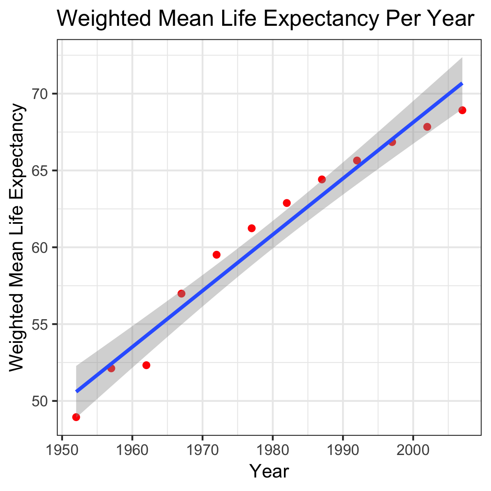

# Assignment 5 Description

The link to the html output file for homework Assignment #5 can be found [here](https://stat545-ubc-hw-2019-20.github.io/stat545-hw-Deni678/hw_05/hw05.html). This file contains Assignment #5 rendered to html output as per the assignment requirements.

The Rmarkdown file for Assignment 5 can be found in the file __hw_05.Rmd__.

The embedded image for Assignment 5 can be found below:

